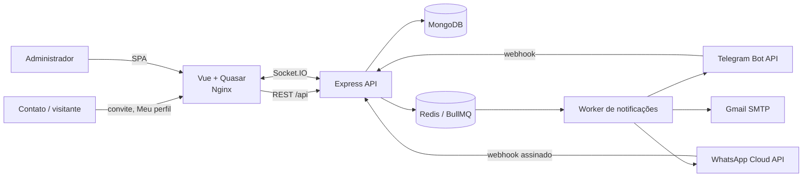

# Notify Flow

O **Notify Flow** é um painel de notificações multicanal orientado a consentimento. Ele centraliza contatos, grupos, templates, filas, conversas e evidências de entrega para **Telegram Bot API**, **WhatsApp Cloud API oficial** e **Gmail**.

O principal problema resolvido é a integração com a API oficial do WhatsApp: mensagens proativas saem por templates aprovados pela Meta, com webhooks de status, rastreabilidade e menor risco operacional do que automações baseadas em uma sessão pessoal. Isso não substitui o cumprimento das políticas da Meta nem garante a entrega de cada mensagem.

## Documentação do projeto

- [Guia técnico e funcional](docs/notify-flow-guia-tecnico-funcional.docx) — tutorial, requisitos, user stories, arquitetura e operação.
- [Apresentação do sistema](docs/notify-flow-apresentacao.pptx) — visão executiva e técnica em slides.
- [Regras dos canais](docs/CHANNELS.md) — capacidades, consentimento e limitações por provedor.
- [API](api/README.md) — camadas, rotas, filas, webhooks e segurança.
- [Frontend](frontend/README.md) — páginas, estado, realtime e build.

## Visão da arquitetura



O backend segue `route -> DTO/middleware -> controller -> manager -> model/service`. MongoDB mantém o estado durável; Redis coordena filas, retries e recursos temporários; Socket.IO atualiza chats, logs e avisos administrativos em tempo real.

## Matriz de canais

| Canal | Campanhas | Conteúdo | Entrada/realtime | Regra principal |
|---|---|---|---|---|
| Telegram | Sim | Texto, foto, vídeo e menus/submenus | Webhook + Socket.IO | O usuário precisa iniciar/interagir com o bot; `/stop` revoga. |
| WhatsApp Cloud | Sim | Templates oficiais aprovados e respostas em janela de atendimento | Webhook Meta + receipts | Fora da janela de 24 horas, mensagens iniciadas pela empresa usam template. |
| Gmail | Sim | Texto e HTML sanitizado | Log de envio | Exige endereço conhecido e consentimento para campanhas. |

Falha ou ausência de um canal não bloqueia os demais. Em um disparo global, o administrador escolhe um template próprio para cada canal selecionado; destinatários sem identidade autorizada ficam como `skipped`, com motivo auditável.

A tela **Chats** representa apenas conversas da API oficial. A Meta não disponibiliza importação da lista ou do histórico do aplicativo: a inbox local é construída por webhooks recebidos e envios feitos pelo Notify Flow, com atualização via Socket.IO. Respostas em texto livre respeitam a janela de atendimento de 24 horas. O histórico local tem ciclo de 30 dias e pode ser exportado manualmente em JSON antes da expiração.

## Jornadas principais

### Contato

1. Abre um convite público e lê Termos de Uso, Termos de Serviço e Política de Privacidade.
2. Inicia o canal escolhido e autoriza notificações quando aplicável.
3. Pode acessar `/meu-perfil` por telefone, confirmando `/login` no WhatsApp oficial, ou por email, usando um link assinado de uso único válido por no máximo sete dias.
4. Consulta seus dados e histórico e revoga permissões separadamente.

### Administrador

1. Configura e testa cada provedor de forma independente.
2. Cadastra contatos/grupos e cria templates por formulários, sem editar JSON.
3. Seleciona contatos ou grupos e agenda um envio por canal ou global.
4. Acompanha fila, tentativas, receipts, falhas e contatos que precisam de autorização.

## Preparação da Meta e do WhatsApp oficial

Para produção, a Meta espera uma organização real e dados consistentes. O fluxo resumido é:

1. constituir/usar uma empresa real e manter documentos, telefone, domínio e endereço verificáveis;
2. criar uma conta pessoal no Facebook para administrar os ativos;
3. criar uma Página da empresa e associá-la a um **Portfólio Empresarial (Business Manager)** como requisito de governança deste projeto — a Página é recomendada, mas não é um requisito técnico universal da Cloud API para todo caso de envio;
4. em [developers.facebook.com/apps](https://developers.facebook.com/apps/), criar um app do tipo Empresa e adicionar o produto WhatsApp;
5. no modo de teste, usar o número, token temporário e destinatários autorizados fornecidos pela Meta;
6. criar/configurar a WABA, o número de produção, método de pagamento, permissões, URLs públicas e webhook HTTPS;
7. criar e submeter templates, aguardar aprovação e testar mensagens e receipts;
8. verificar a empresa, concluir os requisitos de análise/permissões e colocar o app em modo ao vivo quando aplicável.

O modo de teste é limitado a recursos e destinatários de teste. Em produção, preços, categorias de template e limites de conversas iniciadas pela empresa variam por mercado, categoria, conta e política vigente. O nível atual aparece no WhatsApp Manager; sua evolução depende de verificação, qualidade e volume de mensagens elegíveis. Consulte sempre as páginas oficiais de [preços](https://whatsappbusiness.com/products/platform-pricing/) e [onboarding/limites](https://whatsappbusiness.com/resources/resource-library/api-onboarding/), porque esses critérios podem mudar.

A revisão pode exigir documentos societários, correspondência exata dos dados da empresa, domínio, política de privacidade, método de pagamento e comprovação do caso de uso. Planeje essa burocracia antes da data de lançamento.

### Templates do sistema

Três templates WhatsApp Cloud são semeados e protegidos contra exclusão:

| Ambiente | Nome oficial | Idioma | Uso |
|---|---|---|---|
| OFICIAL META TEST NUMBER | `jaspers_market_plain_text_v1` | `en_US` | Exemplo disponibilizado em determinadas contas de teste; sem parâmetros. |
| OFICIAL META TEST NUMBER | `jaspers_market_order_confirmation_v1` | `en_US` | Exemplo de conta de teste com nome, número do pedido e data. |
| OFICIAL META PROD NUMBER | `3p_direct_integration_test_template` | `en_US` | Teste de integração com um número de produção; sem parâmetros. |

O nome e o idioma precisam estar disponíveis e aprovados na conta do WhatsApp Business que atende o número remetente correspondente. O preset `hello_world` também está disponível para teste, mas não é um registro fixo do banco.

O acesso ao Meu perfil não depende de template de autenticação. Por telefone, a página abre o número oficial com `/login` e um marcador assinado; após o webhook confirmar o mesmo contato, a API responde dentro da janela de atendimento com um link de uso único. Por email, esse link é enviado ao endereço já vinculado. O segredo fica no fragmento da URL, é removido antes da troca e nunca é salvo no histórico do chat.

### Conjuntos de templates

Um conjunto reutilizável associa de um a três templates, no máximo um por WhatsApp Cloud, Telegram e Gmail, e pode ser vinculado a um convite. O mesmo template pode participar de vários conjuntos. No disparo global, o administrador escolhe um conjunto ou monta a seleção manual por canal; apenas os canais presentes entram na fila.

## Execução local com Docker

Requisitos: Docker Engine/Desktop 24+ e Docker Compose v2.

```powershell
Copy-Item .env.example .env
# Troque senhas, chaves e URLs antes de iniciar.
docker compose up --build -d
docker compose ps
```

- Painel: <http://localhost:8080>
- Health da API: <http://localhost:3000/api/health>
- Login: `ADMIN1_EMAIL` e `ADMIN1_PASSWORD` definidos no `.env` local.

O Compose sobe `frontend`, `api`, MongoDB e Redis. Os volumes `mongo_data`, `redis_data` e `whatsapp_sessions` preservam dados entre reinícios. `docker compose down --volumes` apaga esses dados e deve ser usado apenas de forma intencional.

## Variáveis de ambiente

Use `.env.example` como catálogo e nunca versione `.env`.

| Grupo | Variáveis principais |
|---|---|
| URLs/infra | `PUBLIC_APP_URL`, `CORS_ORIGINS`, `API_PORT`, `FRONTEND_PORT`, `MONGODB_URI`, `REDIS_URL`, `REDIS_REQUIRED` |
| Administração | `ADMIN{N}_EMAIL`, `ADMIN{N}_PASSWORD` |
| JWT/criptografia | `JWT_ACCESS_SECRET`, `JWT_REFRESH_SECRET`, `PROFILE_JWT_SECRET`, `ENCRYPTION_KEY`, `SEARCH_HASH_KEY`, `INVITE_TOKEN_SECRET` |
| Meu perfil | `PROFILE_JWT_TTL`, `PROFILE_CODE_TTL_SECONDS`, `PROFILE_CODE_MAX_ATTEMPTS`, limites de solicitação/reenvio |
| Telegram | `TELEGRAM_BOT_TOKEN`, `TELEGRAM_WEBHOOK_SECRET`, `TELEGRAM_BOT_USERNAME`, `START_VERIFY_TELEGRAM_PERMISSION` |
| WhatsApp Cloud | `WHATSAPP_CLOUD_ACCESS_TOKEN`, IDs, verify token, app secret, versão e número público |
| Gmail | `GMAIL_USER`, `GMAIL_APP_PASSWORD`, `GMAIL_FROM`, `GMAIL_FROM_NAME` |
| Consentimento | `START_NOTIFY_WHATSAPP_PERMISSION` (`/notify-me` por padrão) |

Credenciais de canal podem ser cadastradas na tela **Início**. Valores runtime ficam criptografados no MongoDB, prevalecem sobre o ambiente e são retornados à UI apenas como “configurado/não configurado”. `PUBLIC_APP_URL` continua sendo a fonte para links públicos; não há URL ngrok fixa no código.

`API_PORT` e `FRONTEND_PORT` controlam somente as portas publicadas pelo Docker
Compose na máquina local. Não os cadastre nos serviços do Render; em produção,
o backend usa `PORT` e o frontend recebe a porta automaticamente da plataforma.

## Fila, retries e observabilidade

- BullMQ processa até cinco jobs simultâneos no worker atual.
- O job e cada entrega admitem até quatro tentativas, com backoff para falhas transitórias.
- Um marcador no MongoDB preserva notificações que não puderam ser enfileiradas; uma varredura recupera estados parados.
- Contatos, grupos, consentimentos e configuração são revalidados antes de cada entrega.
- Logs ocultam chaves sensíveis e expiram em 180 dias por padrão; receipts do WhatsApp Cloud são reconciliados com cada entrega.
- Socket.IO exige JWT administrativo e transmite somente eventos operacionais autenticados.

## Rotas de alto nível

| Área | Prefixo |
|---|---|
| Auth administrativa | `/api/auth` |
| Contatos e grupos | `/api/contacts`, `/api/contact-groups` |
| Templates e campanhas | `/api/templates`, `/api/notifications` |
| Conversas locais | `/api/conversations` |
| Canais | `/api/telegram`, `/api/whatsapp-cloud`, `/api/email` |
| Webhooks | `/api/webhooks/telegram`, `/api/webhooks/whatsapp-cloud` |
| Convites e termos públicos | `/api/public/invites`, `/api/public/terms` |
| Meu perfil | `/api/my-profile` |
| LGPD e auditoria | `/api/privacy`, `/api/logs`, `/api/admin-notifications` |

## Deploy com Render Blueprint

O arquivo suportado pelo Render é **[`render.yaml`](render.yaml)** — não existe formato `render.xml` para Blueprints. Consulte a [especificação oficial de Blueprints](https://render.com/docs/blueprint-spec). O Blueprint deste projeto provisiona:

- frontend Docker público, que também encaminha `/api` e `/socket.io`;
- API Docker privada referenciada pelo Blueprint;
- Render Key Value compatível com Redis;
- `MONGODB_URI` solicitado durante o sync para uma instância MongoDB Atlas.

Antes do primeiro deploy, informe as credenciais administrativas e a URI do
Atlas. O Blueprint já configura `PUBLIC_APP_URL` e `CORS_ORIGINS` como
`https://notify-flow.onrender.com`. No Atlas, autorize a saída do Render e
exija TLS. Integrações externas podem ser configuradas depois pela UI. Os
modelos completos, sem segredos reais, estão em
[`api/render.env.example`](api/render.env.example) e
[`frontend/render.env.example`](frontend/render.env.example).

Os três recursos do Blueprint usam `plan: starter`: é o menor tipo de instância
pago para o frontend, a API privada e o Render Key Value. Assim, nenhum deles
usa a modalidade gratuita que hiberna.

O frontend usa um template de configuração do Nginx em runtime. No Compose,
`API_UPSTREAM=api:3000`; no Render, o Blueprint injeta automaticamente o
`hostport` privado real da API. O entrypoint acrescenta ao hostname curto o
domínio de busca de `/etc/resolv.conf`, porque o resolver assíncrono do Nginx
não aplica esse sufixo sozinho. A API permanece privada e não recebe subdomínio
`onrender.com`; sua borda pública é
`https://notify-flow.onrender.com/api`, encaminhada pelo frontend.

[WebSockets são suportados](https://render.com/docs/websocket), mas o cliente deve reconectar após deploys ou manutenção. Para MongoDB, siga as recomendações de [deploy e backup do Render](https://render.com/docs/deploy-mongodb) ou use Atlas gerenciado.

## Qualidade

```powershell
Set-Location api
npm run check

Set-Location ..\frontend
npm test
npm run build

Set-Location ..
docker compose config
```

Antes de produção, faça smoke test dos webhooks, fila, receipts, opt-out e restauração de backup. A tecnologia oferece controles para LGPD, mas a organização ainda precisa definir base legal, retenção, encarregado, resposta a incidentes e processo de atendimento ao titular.
